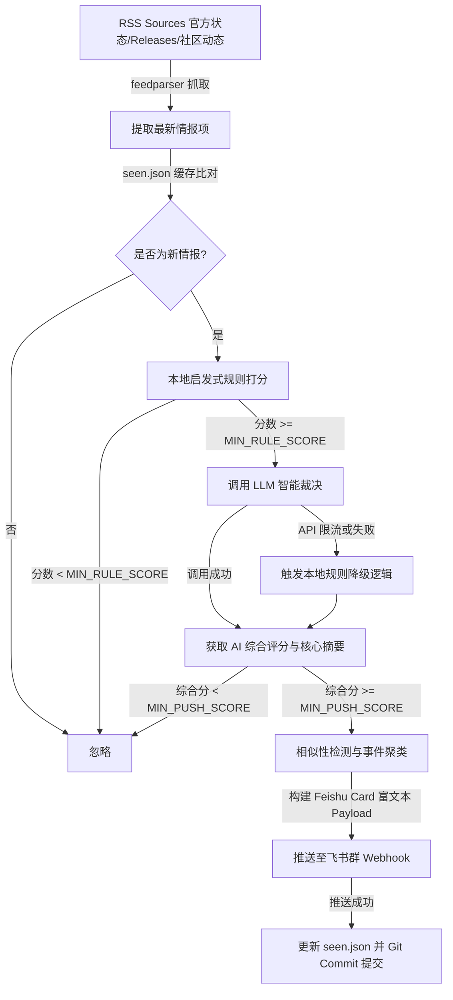

# 🌊 AI Feishu Radar Bot (AI 情报推送机器人)

一个基于 Python 的智能技术动态与故障情报雷达。该系统通过本地启发式评分与大模型（如 Agnes AI）双重智能决策过滤，对高价值 AI/技术动态进行多源语义合并与聚类，最终以精美的交互式卡片形式自动推送至飞书群 Webhook。

[](https://www.python.org/)
[](./LICENSE)
[](.github/workflows/ai-radar.yml)
[](#)

---

## 📖 项目简介

在 AI 行业瞬息万变的今天，及时获取各大主流厂商（OpenAI、Anthropic、GitHub、Google 等）的官方故障状态（Status）、版本发布（Releases）以及精选的技术情报流，是开发者与技术团队的核心诉求。

**AI Feishu Radar Bot** 是为此设计的全自动情报雷达。它通过极轻量的 Serverless GitOps 架构运行，每次执行时拉取最新的 RSS 订阅，经过本地规则初筛与 LLM 的深度语义打分，将真正有价值、紧急的动态合并为一张精致的飞书卡片推送到您的群聊中，同时自动利用 Git 提交机制维护去重状态缓存，无需购买任何云端数据库或常驻服务器。

---

## 🌟 核心特性

1. **多源实时采集**
   - 追踪官方故障状态：OpenAI Status, Anthropic Status, GitHub Status。
   - 追踪核心工具链 Releases：OpenAI Codex, Claude Code, Gemini CLI 等的 Issues 与 Releases。
   - 整合行业情报流：AI Hot RSS (综合、每日、全量)、GitHub Changelog 等。
   
2. **双重智能过滤打分系统**
   - **第一层：本地启发式规则引擎**。基于关键字匹配、来源权威度、故障严重级别等指标进行快速打分。剔除纯提问帖、水贴等无意义噪音（基础分需达到 `MIN_RULE_SCORE`）。
   - **第二层：大语言模型 (LLM) 智能决策**。自动调用兼容 OpenAI 格式的大模型接口（如 Agnes AI/ModelScope/DeepSeek），从**趣味度、紧迫性、安全影响、综合价值**等多维度进行分析打分。
   - **完善的降级机制**：若大模型 API 触发限流（429）或暂时不可用，系统将自动降级为本地规则兜底推送，确保关键故障消息不漏报。

3. **智能语义合并与聚类 (Deduplication & Clustering)**
   - 当同一故障事件被多个 RSS 源重复报道，或者同一服务频繁更新状态时，系统利用 `SequenceMatcher` 算法计算文本相似度，自动将相似事件**聚合并折叠**为单张飞书卡片进行推送，防止信息轰炸。

4. **精美交互式飞书卡片**
   - 根据 AI 评估的紧急与危险程度，卡片自动适配不同的视觉主题（**红色表示紧急故障，黄色表示警告或版本更新，蓝色/绿色表示一般情报**）。
   - 卡片内自动包含 AI 提炼的**核心摘要（一句话简评）、背景分析、影响范围**，并附带所有聚合源的原文链接。

5. **Serverless GitOps 状态持久化**
   - 项目无需数据库。它利用 GitHub Actions 运行，并将已推送历史记录以哈希形式保存在 `seen.json` 中。
   - 每次运行结束时，Actions 会自动将更新后的 `seen.json` 提交（commit）并推送（push）回 GitHub 仓库，实现完全免费的增量去重。

---

## 🛠️ 系统架构



---

## ⚙️ 环境变量配置

在运行项目之前，需要配置以下环境变量。若部署在 GitHub Actions，请将它们配置在 **Repository Secrets** 中：

| 变量名 | 是否必填 | 默认值 | 说明 |
| :--- | :---: | :--- | :--- |
| `FEISHU_WEBHOOK` | **是** | - | 飞书自定义群机器人的 Webhook 地址。 |
| `AGNES_API_KEY` | 否 | - | Agnes AI（或兼容 OpenAI 格式）的 API Key。如果不填，将完全使用本地规则降级运行。 |
| `AGNES_BASE_URL` | 否 | `https://apihub.agnes-ai.com/v1` | 大模型 API 的 Base URL。 |
| `AGNES_MODEL` | 否 | `agnes-2.0-flash` | 大模型名称。建议使用高性能低延迟的 flash 模型。 |

---

## 🚀 快速开始

### 1. 本地运行与测试

在本地进行调试：

```bash
# 1. 克隆项目
git clone https://github.com/waw666waw666/ai-tg-radar-bot.git
cd ai-tg-radar-bot

# 2. 安装依赖
pip install -r requirements.txt

# 3. 设置环境变量 (Windows PowerShell 示例)
$env:FEISHU_WEBHOOK="https://open.feishu.cn/open-apis/bot/v3/token/..."
$env:AGNES_API_KEY="your-agnes-api-key"

# 4. 运行机器人
python main.py
```

---

### 2. GitHub Actions 自动化部署 (推荐)

该项目已内置了 GitHub Actions 工作流文件 `.github/workflows/ai-radar.yml`。

1. **配置 Secrets**：
   - 打开 GitHub 仓库，进入 `Settings` -> `Secrets and variables` -> `Actions`。
   - 新建 Repository Secrets，填入 `FEISHU_WEBHOOK` 与 `AGNES_API_KEY`。

2. **配置定时触发 (Cron)**：
   由于 GitHub 官方的 `cron` 定时任务在免费额度下延迟较高且不甚稳定，推荐使用第三方免费 Cron 服务（如 [cron-job.org](https://cron-job.org/)）来触发机器人：
   - 在 cron-job.org 中创建一个定时任务（例如：每 2 小时执行一次）。
   - 定时任务的请求方式设置为 `POST`。
   - 请求 URL 填入 GitHub Actions 的 Workflow Dispatch API 地址：
     ```http
     https://api.github.com/repos/waw666waw666/ai-tg-radar-bot/actions/workflows/ai-radar.yml/dispatches
     ```
   - 在请求头（Headers）中添加：
     - `Accept: application/vnd.github+json`
     - `Authorization: Bearer <您的 GitHub Personal Access Token (PAT)>`
     - `User-Agent: cron-job.org`
   - 请求体（Body）填入：
     ```json
     { "ref": "main" }
     ```

---

## 📂 项目结构

```percent
ai-tg-radar-bot/
├── .github/
│   └── workflows/
│       └── ai-radar.yml       # GitHub Actions 自动化工作流配置文件
├── main.py                    # 机器人核心逻辑（抓取、打分、AI判定、语义聚类、飞书卡片推送）
├── requirements.txt           # 项目 Python 依赖列表
├── seen.json                  # 已推送情报记录缓存（由 Git 自动提交维护）
└── README.md                  # 项目说明文档
```

---

## 📜 许可证

本项目基于 [MIT License](./LICENSE) 许可协议开源。
